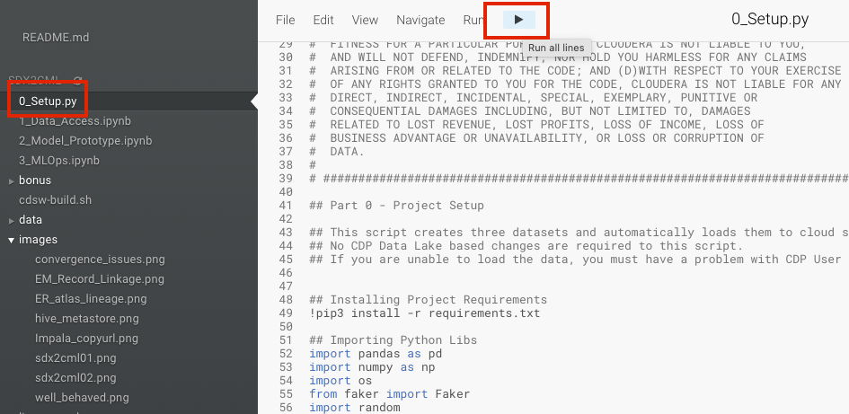

# Machine Learning with the Cloudera Shared Data Experience

CML is not just a Machine Learning platform. It's a ML platform powered by an end to end Data Platform. 

SDX is a fundamental part of Cloudera Data Platform architecture, unlike other vendors’ bolt-on approaches to security and governance. 
Independent from compute and storage layers, SDX delivers an integrated set of security and governance technologies built on metadata and delivers persistent context across all analytics as well as public and private clouds. 
Consistent data context simplifies the delivery of data and analytics with a multi-tenant data access  model that is defined once and seamlessly applied everywhere.
SDX reduces risk and operational costs by delivering consistent data context across deployments. IT can deploy fully secured and governed data lakes faster, giving more users access to more data, without compromise. 

In the context of ML and MLOps, SDX provides the following key benefits:

* You can track ML metadata in Atlas. For example, ML Models are assigned a lineage graph mapping them to datasets and projects.
* You can enforce data access constraints on the entire Model Lifecycle in Ranger. Datasets are assigned row and column level masking rules that govern how a Data Scientist creates models. 
* You can profile and audit users in the CDP Data Catalog. For example, you can determine not only who accessed the data, but also if they did so  
* In CML, Models are protected by Security Constraints. Every prediction request reaching a Model Endpoint optionally requires authentication.

To learn more on SDX please visit [this page](https://www.cloudera.com/products/sdx.html)

## Project Summary

In this project you will explore real world examples of how SDX increases ML Governance and overall compliance with ML Ops Best Practices. 

The project is divided in the following steps:

1. CML Project Setup
2. Create Hive Managed Tables from Cloud Storage in the CDW Virtual Warehouse
3. Validate the Data in the Atlas UI
4. Access the Data in the CML Project via CML Data Connections
5. Restrict user access in the Ranger UI and observe changes in the CML Project
6. Train a ML model with the Hive data and deploy the model to a REST Endpoint via CML API V2. Observe the changes in Atlas

## Prerequisites

This project requires access to a CML Workspace, a CDW Virtual Warehouse, and rights to access the Data Catalog, Ranger and Atlas (SDX) in CDP Public or Private Cloud. 

Familiarity with Python, SQL, and Jupyter Notebooks is recommended. However, no coding is required beyond executing the provided scripts. 

If you are completely new to CML and would like a quick intro to creating Projects, Sessions, using Spark and more, please start with [this repository](https://github.com/pdefusco/CML_CrashCourse)

## Part 1: CML Project Setup

Log into your CML Workspace. Create a new CML Project.

To create the CML Project, clone it from this GitHub repository by pasting this link as shown below. You can leave default runtime settings as they are. 

Start a CML Session with the following settings.

* Session Name: "WB Session" or anything you would like to use
* Editor: "Workbench"
* Enable Spark: Not required  
* Resource Profile: 1 or 2 vCPU / 2 or 4 GiB Memory is fine. Make sure to select 0 GPUs
* Other settings such as Kernel, Edition, Version, can be left to default values

Open script "0_Setup.py" and run all the code at once as shown below. 

## Part 2: Create Hive Managed Tables from Cloud Storage in the CDW Virtual Warehouse

Navigate out of the CML Project and open the CDW Service. 

Open the Hue editor to run queries in your Hive CDW Virtual Warehouse as shown below.

Enter the following queries and execute. 

Notice we are creating a temporary table from each of the three files, and then three Hive Managed Tables correspondingly.

You will proabably have to modify the S3 bucket value. 

To do so, replace the "demo-aws-go02" below with value for the STORAGE variable you copied in your CML Session earlier.

#### Marketing Campaign Table

<code> 
DROP TABLE IF EXISTS marketing_campaign_tbl;

CREATE EXTERNAL TABLE marketing_campaign_tbl(
  name STRING,
  street_address STRING,
  city STRING,
  postcode STRING,
  phone_number STRING, 
  job STRING
  )
ROW FORMAT DELIMITED FIELDS TERMINATED BY ',' STORED AS TEXTFILE LOCATION "s3a://demo-aws-go02/sdxdemodir/mkt_campaign";
  
SELECT * FROM marketing_campaign_tbl;

DROP TABLE IF EXISTS marketing_campaign_table;

CREATE TABLE IF NOT EXISTS marketing_campaign_table(
  name STRING,
  street_address STRING,
  city STRING,
  postcode STRING,
  phone_number STRING, 
  job STRING
  )
COMMENT 'Marketing Campaign';

INSERT OVERWRITE TABLE marketing_campaign_table SELECT * FROM marketing_campaign_tbl;

SELECT * from marketing_campaign_table; 
DROP TABLE marketing_campaign_tbl;
</code>

#### Bank Info Table

<code> 

DROP TABLE IF EXISTS bank_info_tbl;

CREATE EXTERNAL TABLE bank_info_tbl(
  name STRING,
  ABA_routing STRING,
  bank_country STRING,
  account_number STRING,
  IBAN STRING, 
  swift11 STRING, 
  Recency STRING, 
  History STRING, 
  used_discount STRING, 
  used_bogo STRING,
  zip_code STRING, 
  is_referral STRING, 
  channel STRING, 
  offer STRING, 
  conversion STRING, 
  score STRING 
)
ROW FORMAT DELIMITED FIELDS TERMINATED BY ',' STORED AS TEXTFILE LOCATION "s3a://demo-aws-go02/sdxdemodir/bank";

SELECT * FROM bank_info_tbl;

DROP TABLE IF EXISTS bank_info_table;

CREATE TABLE IF NOT EXISTS bank_info_table(
  name STRING,
  ABA_routing STRING,
  bank_country STRING,
  account_number STRING,
  IBAN STRING, 
  swift11 STRING, 
  Recency STRING, 
  History STRING, 
  used_discount STRING, 
  used_bogo STRING,
  zip_code STRING, 
  is_referral STRING, 
  channel STRING, 
  offer STRING, 
  conversion STRING, 
  score STRING 
  )
COMMENT 'Bank Info';

INSERT OVERWRITE TABLE bank_info_table SELECT * FROM bank_info_tbl;

SELECT * FROM bank_info_table; 
DROP TABLE bank_info_tbl;

</code>