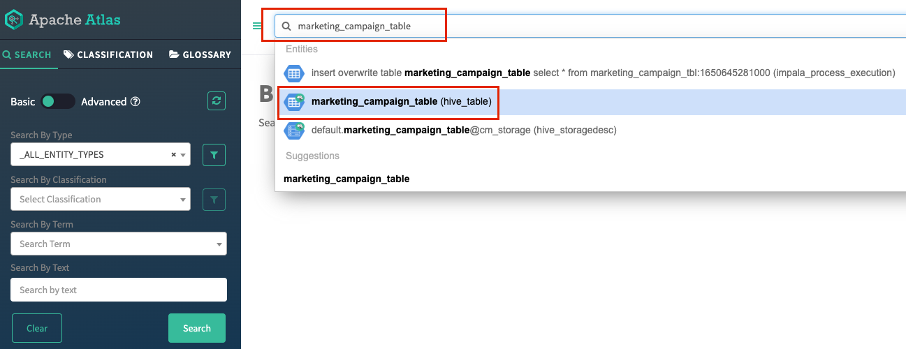
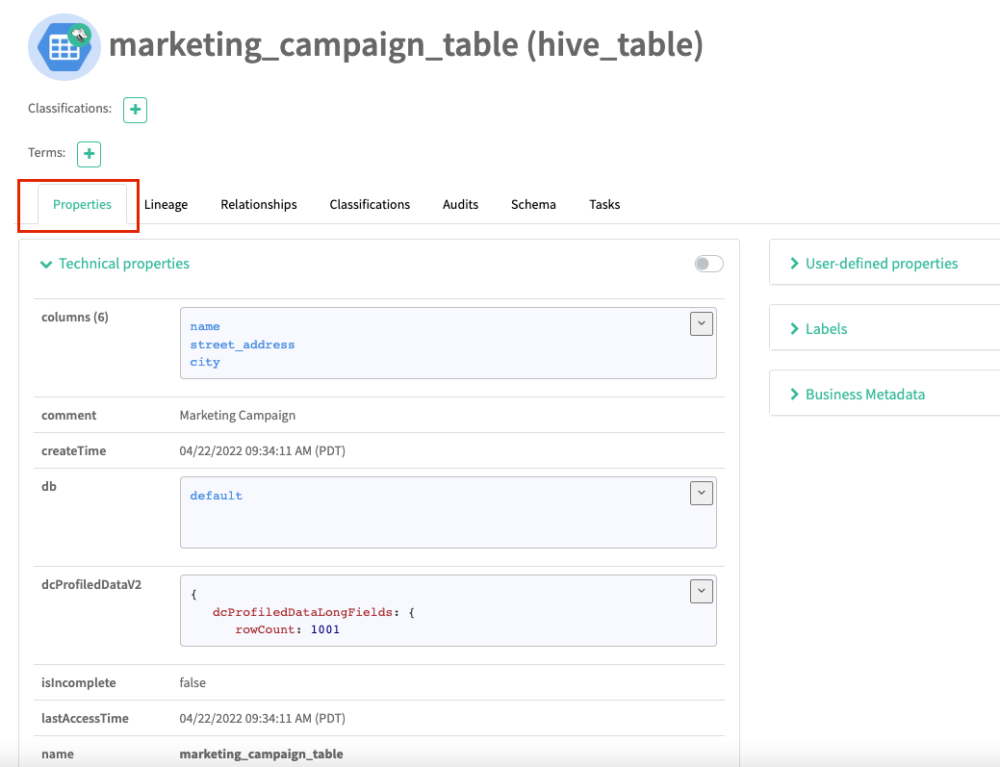
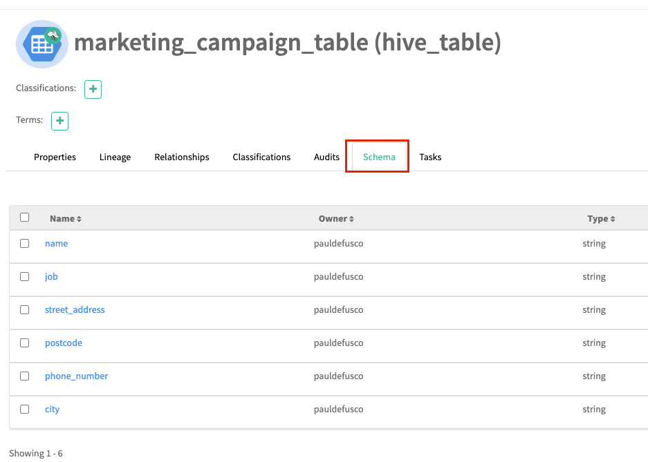
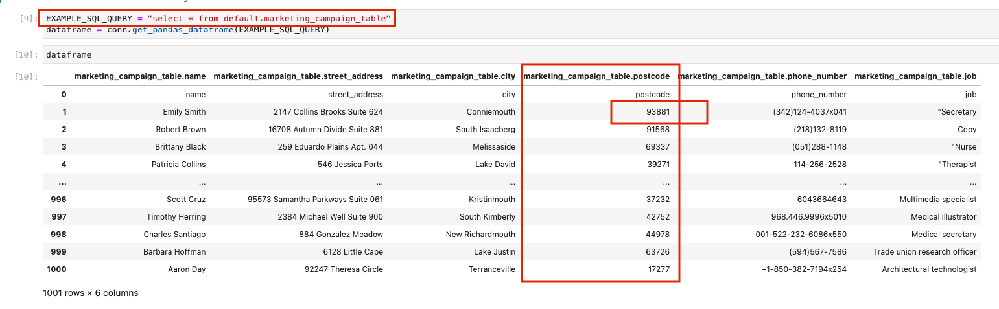

# Machine Learning with the Cloudera Shared Data Experience

CML is not just a Machine Learning platform. It's a ML platform powered by an end to end Data Platform. 

SDX is a fundamental part of Cloudera Data Platform architecture, unlike other vendors’ bolt-on approaches to security and governance. 
Independent from compute and storage layers, SDX delivers an integrated set of security and governance technologies built on metadata and delivers persistent context across all analytics as well as public and private clouds. 
Consistent data context simplifies the delivery of data and analytics with a multi-tenant data access  model that is defined once and seamlessly applied everywhere.
SDX reduces risk and operational costs by delivering consistent data context across deployments. IT can deploy fully secured and governed data lakes faster, giving more users access to more data, without compromise. 

In the context of ML and MLOps, SDX provides the following key benefits:

* You can track ML metadata in Atlas. For example, ML Models are assigned a lineage graph mapping them to datasets and projects.
* You can enforce data access constraints on the entire Model Lifecycle in Ranger. Datasets are assigned row and column level masking rules that govern how a Data Scientist creates models. 
* You can profile and audit users in the CDP Data Catalog. For example, you can determine not only who accessed the data, but also if they did so  
* In CML, Models are protected by Security Constraints. Every prediction request reaching a Model Endpoint optionally requires authentication.

To learn more on SDX please visit [this page](https://www.cloudera.com/products/sdx.html)

## Project Summary

In this project you will explore real world examples of how SDX increases ML Governance and overall compliance with ML Ops Best Practices. 

The project is divided in the following steps:

1. CML Project Setup
2. Create Hive Managed Tables from Cloud Storage in the CDW Virtual Warehouse
3. Validate the Data in the Atlas UI
4. Access the Data in the CML Project via CML Data Connections
5. Restrict user access in the Ranger UI and observe changes in the CML Project
6. Train a ML model with the Hive data and deploy the model to a REST Endpoint via CML API V2. Observe the changes in Atlas

## Prerequisites

This project requires access to a CML Workspace, a CDW Virtual Warehouse, and rights to access the Data Catalog, Ranger and Atlas (SDX) in CDP Public or Private Cloud. 

Familiarity with Python, SQL, and Jupyter Notebooks is recommended. However, no coding is required beyond executing the provided scripts. 

If you are completely new to CML and would like a quick intro to creating Projects, Sessions, using Spark and more, please start with [this repository](https://github.com/pdefusco/CML_CrashCourse)

## Part 1: CML Project Setup

Log into your CML Workspace. Create a new CML Project.

To create the CML Project, clone it from this GitHub repository by pasting this link as shown below.

<code>https://github.com/pdefusco/SDX2CML.git</code>

You can leave default runtime settings to default values. 

Start a CML Session with the following settings.

* Session Name: "WB Session" or anything you would like to use
* Editor: "Workbench"
* Enable Spark: Not required  
* Resource Profile: 1 or 2 vCPU / 2 or 4 GiB Memory is fine. Make sure to select 0 GPUs
* Other settings such as Kernel, Edition, Version, can be left to default values

Open script "0_Setup.py" and run all the code at once as shown below. 

At the end, enter the following code into the prompt. The prompt is located at the bottom right of your screen.

<code>os.environ['STORAGE']</code> 

Take note of the output. This is your Cloud Storage location. You will need this in Part 2. 

## Part 2: Create Hive Managed Tables from Cloud Storage in the CDW Virtual Warehouse

Navigate out of the CML Project and open the CDW Service. 

Open the Hue editor to run queries in your Hive CDW Virtual Warehouse as shown below.

Enter the following queries and execute. 

Notice we are creating a temporary table from each of the three files, and then three Hive Managed Tables correspondingly.

You will proabably have to modify the S3 bucket value. 

To do so, replace the string "s3a://demo-aws-go02" below with value you copied to your clipboard in the CML Session earlier.

#### DDL for Marketing Campaign Table

<code> 
DROP TABLE IF EXISTS marketing_campaign_tbl;

CREATE EXTERNAL TABLE marketing_campaign_tbl(
  name STRING,
  street_address STRING,
  city STRING,
  postcode STRING,
  phone_number STRING, 
  job STRING
  )
ROW FORMAT DELIMITED FIELDS TERMINATED BY ',' STORED AS TEXTFILE LOCATION "s3a://demo-aws-go02/sdxdemodir/mkt_campaign";
  
SELECT * FROM marketing_campaign_tbl;

DROP TABLE IF EXISTS marketing_campaign_table;

CREATE TABLE IF NOT EXISTS marketing_campaign_table(
  name STRING,
  street_address STRING,
  city STRING,
  postcode STRING,
  phone_number STRING, 
  job STRING
  )
COMMENT 'Marketing Campaign';

INSERT OVERWRITE TABLE marketing_campaign_table SELECT * FROM marketing_campaign_tbl;

SELECT * from marketing_campaign_table; 
DROP TABLE marketing_campaign_tbl;
</code>

#### DDL for Bank Info Table

<code> 
DROP TABLE IF EXISTS bank_info_tbl;

CREATE EXTERNAL TABLE bank_info_tbl(
  name STRING,
  ABA_routing STRING,
  bank_country STRING,
  account_number STRING,
  IBAN STRING, 
  swift11 STRING, 
  Recency STRING, 
  History STRING, 
  used_discount STRING, 
  used_bogo STRING,
  zip_code STRING, 
  is_referral STRING, 
  channel STRING, 
  offer STRING, 
  conversion STRING, 
  score STRING 
)
ROW FORMAT DELIMITED FIELDS TERMINATED BY ',' STORED AS TEXTFILE LOCATION "s3a://demo-aws-go02/sdxdemodir/bank";

SELECT * FROM bank_info_tbl;

DROP TABLE IF EXISTS bank_info_table;

CREATE TABLE IF NOT EXISTS bank_info_table(
  name STRING,
  ABA_routing STRING,
  bank_country STRING,
  account_number STRING,
  IBAN STRING, 
  swift11 STRING, 
  Recency STRING, 
  History STRING, 
  used_discount STRING, 
  used_bogo STRING,
  zip_code STRING, 
  is_referral STRING, 
  channel STRING, 
  offer STRING, 
  conversion STRING, 
  score STRING 
  )
COMMENT 'Bank Info';

INSERT OVERWRITE TABLE bank_info_table SELECT * FROM bank_info_tbl;

SELECT * FROM bank_info_table; 
DROP TABLE bank_info_tbl;
</code>

#### DDL for Bank Info Table

<code> 
DROP TABLE IF EXISTS cc_info_tbl;

CREATE EXTERNAL TABLE cc_info_tbl(
  name STRING,
  credit_card_number STRING,
  credit_card_provider STRING,
  credit_card_security_code STRING,
  credit_card_expire STRING
  )
ROW FORMAT DELIMITED FIELDS TERMINATED BY ',' STORED AS TEXTFILE LOCATION "s3a://demo-aws-go02/sdxdemodir/creditcard”;
  
SELECT * FROM cc_info_tbl;

DROP TABLE IF EXISTS cc_info_table;

CREATE EXTERNAL TABLE cc_info_table(
  name STRING,
  credit_card_number STRING,
  credit_card_provider STRING,
  credit_card_security_code STRING,
  credit_card_expire STRING
  )
COMMENT 'Credit Card Info';
  
INSERT OVERWRITE TABLE cc_info_table SELECT * FROM cc_info_tbl;

SELECT * FROM cc_info_table; 
DROP TABLE cc_info_tbl;
</code>

For more on creating Hive Managed Tables please visit [the documentation](https://docs.cloudera.com/cdp-private-cloud-base/7.1.6/using-hiveql/topics/hive_create_an_external_table.html)

## Part 3: Create Hive Managed Tables from Cloud Storage in the CDW Virtual Warehouse

Exit Hue and navigate back to the CDW Database Catalog. 

Open the Atlas UI corresponding to the Virtual Warehouse where you executed the above queries.

Atlas has a lot of useful Data Governance features but those are beyond the scope of this demo. 

To access table metadata, simply enter their names in the bar at the top of the page and select the relevant result of type “Hive Table”.

The properties tab is opened by default. A lot of table metadata is stored here including table attributes, row counts, database information and more. 

Expand the “User-defined properties”, “Labels” and “Business Metadata” sections. You can use these to further categorize and then easily search your assets. 

The Lineage tab allows you to visualize your data as it is created, transformed, and persisted. Notice that all the below is created for you by default, without any user actions. 

Data, transformations and user actions are tracked by means of “Atlas Hooks”, powered by Kafka. CDP SDX manages this for you at the infrastructure level. 

Then create a custom classification for this Machine Learning Project by clicking on the “plus sign” icon. 
Notice existing classifications are shown by default. Pick a random classification and observe that Atlas model instances of different types are returned in the main screen.  

We will create a custom classification and apply it to our tables. 

Navigate back to the Atlas entity for each of the three tables. Open the classifications tab and apply the new classification. 

You can leave default options such as validity period to their default value. 

Repeat the same steps for “cc_info_table” and “bank_info_table”. 

Then navigate back to the Classifications tab and browse for all entities carrying it.

## Part 4: Access the Data in the CML Project via CML Data Connections

Navigate back to CML and create a new session using Jupyter Notebooks. Make sure to launch it with the following options (you can leave the rest to their defaults):

* Editor: JupyterLab
* Kernel: Python 3.7 or above
* Enable Spark: Optional
* Resource Profile: 2 vCPU / 4 GiB Mem

Once the session has started, the “Data Connections” page will immediately open. 
This window contains sample code to connect to any of your Hive or Impala Datawarehouses via Spark Hive Warehouse Connector or the Impyla Python library.

These are not just examples though. This is the code you need with the values you need to access your data, all prefilled for you. You can just copy and paste it into your notebook and execute it. 

Select the “Hive” option reflecting the Hive CDW Virtual Warehouse that you created your three tables with earlier. Copy the code to your clipboard and then close the window. 

Open the “1_Data_Access.ipynb” notebook and paste the code in the first open cell. Notice an old stub has already been entered for you, but the values are likely not the same needed for your Data Lake. 

Highlight the cell and execute the code. There are multiple ways to do so, but the fastest is to press “Shift” + “Enter” on your keyboard. 
You can also click on the “play” button or “Run” -> “Run Selected Cells” on the top pane. 

Notice the output in the cell is the output of the “SHOW DATABASES” query. 

You can modify the SQL syntax at will to execute more advanced queries. For example, you can use the same template to load data from Hive into a Pandas Dataframe. 

Scroll down in your notebook and execute the next cells. Notice that you are just updating the SQL syntax. The connection to the Hive Virtual Warehouse is the same. 

Before moving on, notice the Pandas dataframe shape is 1001 rows x 6 columns. This is the original data contained in the CSV file we loaded from Cloud Storage.

## Part 5: Restrict user access in the Ranger UI and observe changes in the CML Project

Exit CML and navigate back to the CDW Database Catalog. 

Open the Ranger UI corresponding to the Virtual Warehouse where you executed the above queries.

With Ranger, you can apply policies to protect your data. Familiarize yourself with the Ranger UI. 
Notice there is a section for virtually any CDP Service, including ADLS and S3. 

Next, we will enforce stricter data access policies to our Hive tables. 
Click on the “Hadoop SQL” section and open policy 9: “all - database, table, column” by clicking on the edit icon.

Familiarize yourself with the interface. This is the easiest way to grant or deny access levels at the database, table and column level. 

Scroll down to the “Allow Conditions” section, then in the “Exclude from Allow Conditions” subsection add your username and set the “Permissions” option to “All” as shown below. 
Save the changes to the policy. 

Navigate back to your CML project. Open the same CML Session and go back to notebook “1_Data Access.ipynb”. 
Rerun the notebook from the start, making sure to also rerun the cell where you initiate the connection to the CDW Virtual Warehouse. 

The second cell should now fail. This is the SQL statement where you attempt to retrieve all data in the Hive table. 
Notice that while this failed, the previous statement succeeded. 
This is because you have only denied yourself access to the table, but not the database 
(recall that the previous statement was a simple “SHOW DATABASE”).

Scroll down to the end of the error trace in the notebook cell and notice the actual Ranger Data Access error. 

Ranger provides Data Stewards and Admins with the ability to enforce more granular access policies at the column and row level. 

Go back to the “Hadoop SQL” page in Ranger and remove the deny condition you placed on your user under the “Exclude from Allow Conditions” section. Hit save. 

Next, we will mask table columns. From the “Hadoop SQL” tab, open the “Masking” tab.

Click on “Add New Policy” on the right side of the page. Fill out the new policy as shown below. 

Scroll down to the “Mask Conditions” section and choose the “Hash” Masking Option for your user. 

Before saving the changes, familiarize yourself with the different masking options. You don’t necessarily have to hash the entire column value. 

To validate the changes, go back to your notebook in CML and rerun the three cells. 
They all succeed, but if you scroll down to the output of the third cell you will notice that the “street_address” value is now hashed. 

Next, we will proceed to mask rows. No need to remove the masking policy this time. 
Navigate back to Ranger, “Hadoop SQL”, and then open the “Row Level Filter” tab and click on “Add New Policy”.

Edit the policy details as shown below.

Then set the “Row Filter Conditions” section with your username, “Access Type” to “Select”, and apply the following condition in the “Row Level Filter” column:

marketing_campaign_table.postcode =! "93881"

Navigate back to your CML notebook and execute all three cells again. 
Make sure you execute the first cell in particular, as you will need to reconnect to the Hive Virtual Warehouse in order to be affected by the changes in Ranger. 

Notice the row count has changed. We now have 1000 rows rather than 1001. 
We are no longer allowed to access campaign targets who live in the 93881 postal code. 

## Part 6: Train a ML model with the Hive data and deploy the model to a REST Endpoint via CML API V2. Observe the changes in Atlas

In this section we will train a simple classifier. 

Navigate back to your CML Project and open your Jupyter Lab session. 
Open and familiarize notebooks “2_Model_Prototype.ipynb” and “3_MLOps.ipynb”.

#### Executing Notebook 2

Notebook “2_Model_Prototype.ipynb” walks you through a simplified Model Evaluation pipeline with the Sci-Kit Learn library. 
The goal is to compare the quality of an AdaBoost and RandomForestClassifier and pick one. The best model is saved for reuse.   

Run all cells in the notebook. No changes to the code are required, 
you can run all cells in bulk by clicking on “Run” -> “Run All” or simply “shift + enter” on each individual cell.

#### Executing Notebook 3

Notebook “3_MLOps.ipynb” demonstrates a simplified ML Ops pipeline. 
The objective is to create a CML Models endpoint and push the classifier we chose in the previous notebook. 
Notice this notebook is making heavy use of CML API V2. 

Again, run all cells in the notebook without changing the code. 

Navigate back to the CML Project home folder. You should see a new CML Models endpoint. 
Wait a minute or two for the deployment process to finish. The endpoint should look like this after a bit.

Scroll down and examine the Files section. 
You now should see a “lineage.yml” file. Open it and examine it. 
This is where metadata for your models is stored.

We created this file programmatically in “3_MLOps.ipynb” but it’s actually optional. 
If you create it, Atlas will track the model along with its metadata exactly the way it tracked your Hive tables earlier. 
This is because CML Models type have been added to the Atlas entity model by Cloudera.

Before moving on, take down the “build-id” associated with your model. 
This is located in the Model’s metadata landing page. You can reach it by clicking on the model in the “Overview” page. 

The build ID is on the right side of the screen under “Model Details”: 

Now copy the model name and build ID to your editor and merge them into a single string separated by a dash:

*model_name-build_id*

For example:

*demo-model-ghmcxa-6*

Navigate back to Atlas and search for your model by inputting its name using the above string.

Open the Atlas entity. Just like our Hive tables earlier, the model has its own metadata. 
For example, scroll down in the “Properties” tab and open the “metadata” section as shown below. 
This metadata can be customized at will by editing the associated “lineage.yml” file in the CML Project. 

Expand the “Lineage” tab and observe the full data origin from Hive. 
All the way on the left side, click on the icon representing the CML Project and then on its “guid”.

Now observe you have navigated away from the CML Model entity and have opened the Atlas Lineage tab for the entity representing the CML Project the model has been deployed in. 

## Conclusions

SDX is a fundamental component in the Cloudera Data Platform. Every CDP Data Service leverages it in some way. 

The benefits of a unified control layer for Security, Governance and Data Cataloging increase exponentially with the complexity of your use cases.

* Hive tables used by DW Teams are easily accessible to ML Stakeholders.
* Data Scientist data access in CML is easy, but constrained by Ranger Policies that optionally only SDX users have the ability to change.
* This implies Data Science efforts are automatically governed. 
* Legal compliance is not only achieved by the ability to govern Data Scientists' access to features, but by the ability to prove that you were able to impose such limits. 
* Visibility into models, datasets, features, and custom ML metadata is also key for ML Ops and specifically Model Reproducibility.  

## Related Demos and Tutorials

If you are evaluating CML you may also benefit from testing the following demos:

* [Telco Churn Demo](https://github.com/pdefusco/CML_AMP_Churn_Prediction): Build an End to End ML Project in CML and Increase ML Explainability with the LIME Library
* [Learn how to use Cloudera Applied ML Prototypes](https://docs.cloudera.com/machine-learning/cloud/applied-ml-prototypes/topics/ml-amps-overview.html) to discover more projects using MLFlow, Streamlit, Tensorflow, PyTorch and many more popular libraries
* [CSA2CML](https://github.com/pdefusco/CSA2CML): Build a real time anomaly detection dashboard with Flink, CML, and Streamlit
* [CML2CDE](https://github.com/pdefusco/CML2CDE): Build CI/CD pipelines for Spark with the CDE API, CDE CLI, and CML API v2
* [API v2](https://github.com/pdefusco/CML_AMP_APIv2): Familiarize yourself with API v2, CML's goto Python Library for ML Ops and DevOps
* [MLOps](https://github.com/pdefusco/MLOps): Explore a detailed ML Ops pipeline powered by Apache Iceberg

#### Next Steps

This demo provided an introduction to SDX core capabilities. However, you can leverage SDX in many more ways:

* Accessing Atlas with its API and Python Client from CML to customize ML Metadata
* Accessing Ranger with its API and Python Client from CML to automate ML Compliance
* Building an NLP project with Atlas Entity Descriptions

Please don't hesitate to reach out to your Cloudera Account Team if you want to explore these further. 

